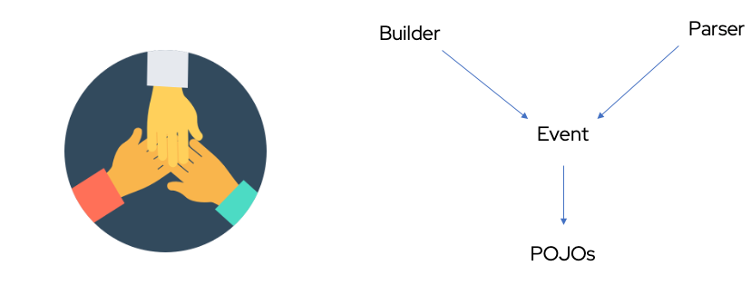

# iDAAS-EventBuilder
iDAAS EventBuilder is designed to help ANY implementation build, parse and/or transform data.

## iDAAS-EventBuilder Design Concepts
iDAAS EventBuilder is built on a tiered concept. Here is a visual to help and try and visualize what Event Builder is 
and how the various parts of Event Builder correlate.

  
- Builders are to build specific data structures. They build data through events.  
- Parsers are specific to parsing types of data  
- Events are structures that are meant to lift up the POJOs and provide them a specific structure.  
- Pojos are the data object meant to be leveraged for ANY data building or parsing activity.

## POM Files
This project also contains a POM file to pull in needed third party libraries. The needed library
is for org.apache.commons and it is leveraged to help us return toString() for all the pojos we 
deliver. 

# Scenario: Integration 
You can leverage this repository once you have cloned the repository locally through a local Maven install.
    
# Builds
This section will cover both local and automated builds.

## Local Builds
Within the code base you can find the local build commands in the /platform-scripts directory
1.  Run the build-solution.sh script
It will run the maven commands to build and then package up the solution. The package will use the usual settings
in the pom.xml file. It pulls the version and concatenates the version to the output jar it builds.
Additionally, there is a copy statement to remove any specific version, so it outputs idaas-connect-hl7.jar

## Automated Builds
Automated Builds are going to be done in Azure Pipelines

# Ongoing Enhancements
We maintain all enhancements within the Git Hub portal under the 
<a href="https://github.com/RedHat-Healthcare/iDAAS-EventBuilder/projects" target="_blank">projects tab</a>

# Defects/Bugs
All defects or bugs should be submitted through the Git Hub Portal under the 
<a href="https://github.com/RedHat-Healthcare/iDAAS-EventBuilder/issues" target="_blank">issues tab</a>

# Chat and Collaboration
You can always leverage <a href="https://redhathealthcare.zulipchat.com" target="_blank">Red Hat Healthcare's ZuilpChat area</a>
and find all the specific areas for iDAAS-EventBuilder. We look forward to any feedback!!

If you would like to contribute feel free to, contributions are always welcome!!!! 

Happy using and coding....
